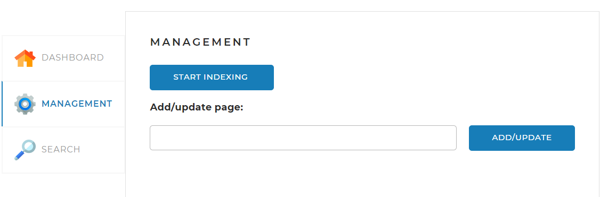

# SearchEngine
Данный проект реализует поисковый движок, предоставляющий пользователю специальный
API со следующими основными функциями: 
<li>предварительное индексирование сайтов;</li>
<li>выдача основных сведений по сайтам;</li>
<li>поиск ключевых слов в проиндексированных сайтах и предоставление их пользователю.</li>

## Веб-страница

В проект также входит веб-страница, которая позволяет управлять процессами, реализованными
в движке.

Страница содержит три вкладки.

### Вкладка DASHBOARD

Эта вкладка открывается по умолчанию. На ней
отображается общая статистика по всем проиндексированным сайтам, а также
детальная статистика и статус по каждому из сайтов (статистика,
получаемая по запросу <i>/statistics</i>).

### Вкладка MANAGEMENT

На этой вкладке находятся инструменты управления 
поисковым движком — запуск (запрос <i>/startIndexing</i>) 
и остановка (запрос <i>/stopIndexing</i>) полной индексации
(переиндексации), а также возможность добавить (обновить)
отдельную страницу по ссылке (запрос <i>/indexPage/{pagePath}</i>).

### Вкладка SEARCH

Эта вкладка предназначена для тестирования поискового
движка. На ней находится поле поиска и выпадающий список с
выбором сайта, по которому искать, а при нажатии на кнопку
<i>SEARCH</i> выводятся результаты поиска (по запросу /search).

## Файлы настройки
Данное приложение работает с СУБД MySQL. Конфигурационный файл находится в корне проекта.

Приложение допускает подключение и к другим реляционным БД. Для 
этого необхоимо в файле application.yaml сделать соответствующие корректировки. 
Кроме того, в файле <i>pom.xml</i> нужно подключить
подходящую зависимость, обеспечивающую работу с выбранной БД.

#### Список <i>sites</i>
Здесь приведён список сайтов, которые программа будет
в состоянии индексировать. Каждый сайт характеризуется
следующими параметрами:
<li>
<i>url</i> — адрес сайта;
</li>
<li>
<i>name</i> — имя сайта. Оно, в частности, выводится в списке сайтов
на вкладке DASHBOARD;
</li>

## Используемые технологии
Приложение построено на платформе <i>Spring Boot</i>.

Необходимые компоненты собираются с помощью фреймворка Maven.
Maven подключает следующие относящиеся к <i>Spring Boot</i> стартеры:
<li>
<i>spring-boot-starter-web</i> — подтягивает в проект библиотеки, 
необходимые для выполнения Spring-MVC функций приложения.
</li>
<li>
<i>spring-boot-starter-data-jpa</i> — отвечает за подключение библиотек,
требующихся для работы приложения с базой данных;
</li>
<li>
<i>spring-boot-starter-thymeleaf</i> — шаблонизатор веб-страницы программы.
</li>

Для загрузки и разбора страниц с сайтов используется библиотека <i>jsoup</i>.

Данная версия программы работает с СУБД MySQL.

Для удобства написания (и чтения) программного кода и для
расширения функциональности языка Java используется библиотека
Lombok (зависимость <i>lombok</i>).

## Запуск программы
Репозиторий с приложением SearchEngine находится по адресу
[https://github.com/foller87/lame_horse](https://github.com/foller87/lame_horse.git).

Если проект загрузить на локальный диск, то он готов к тому,
чтобы его можно было скомпилировать и запустить с помощью среды
разработки IntelliJ IDEA.

Перед первой компиляцией программы следует выполнить следующие шаги:
<ol>
<li>
Установить СУБД — одну или несколько, если они ещё не установлены.
</li>
<li>
В базе данных создать схему <i>search_engine</i>. Имя схемы может быть и
другим, но тогда это должно быть отражено в параметре
<i>spring.datasource.url</i> в файле <i>application.yaml</i>.
</li>
<li>
В схеме нужно создать пользователя <i>root</i> с паролем 
<i>1907181</i>. Пользователь и пароль могут быть другими, это опять
же должно соответствовать параметрам <i>spring.datasource.username</i> и 
<i>spring.datasource.password</i> в файле <i>application.yaml</i>.
</li>
<li>
Установить фреймворк Apache Maven, если он ещё не установлен.
</li>
</ol>

Теперь приложение можно компилировать и запускать из программной среды.

Приложение может быть также запущено командной строкой. Для этого 
оно должно быть скомпилировано в панели <i>Maven</i> среды разработки  
командой <i>package</i>:

Результат компиляции, <i>SearchEngine-0.0.1-SNAPSHOT.jar</i>, 
будет располагаться в папке <i>target</i>. Этот файл можно перенести
в любую доступную папку на компьютере, при этом в той же папке 
должен находиться файл <i>application.yaml</i>.
